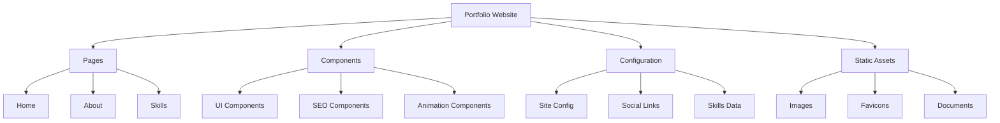

# Astro Portfolio Development Guide

## Table of Contents

- [1. Introduction to Astro](#1-introduction-to-astro)
- [2. Project Structure](#2-project-structure)
- [3. Key Astro Concepts](#3-key-astro-concepts)
- [4. Portfolio Implementation Guide](#4-portfolio-implementation-guide)
- [5. Best Practices & Optimizations](#5-best-practices--optimizations)

## 1. Introduction to Astro

### What is Astro?

Astro is a modern static site generator that offers:

- **Zero-JS by default**: Ships zero JavaScript to the client by default
- **Component Islands**: Add interactivity only where needed
- **Framework-agnostic**: Use React, Vue, Svelte, or plain HTML/CSS
- **Great Developer Experience**: TypeScript support, Hot Module Reloading
- **Excellent Performance**: Built for speed and optimization

### Why Astro for Portfolio?

1. **Fast Performance**

   - Static site generation
   - Minimal JavaScript
   - Optimized assets

2. **SEO Friendly**

   - Static HTML output
   - Built-in meta tag management
   - Easy sitemap generation

3. **Developer Experience**
   - Simple component model
   - TypeScript support
   - Markdown support

## 2. Project Structure

```
portfolio/
├── src/
│   ├── components/    # Reusable UI components
│   ├── layouts/       # Page layouts
│   ├── pages/         # Route components
│   ├── config/        # Site configuration
│   ├── styles/        # Global styles
│   └── types/         # TypeScript definitions
├── public/           # Static assets
└── astro.config.mjs  # Astro configuration
```

### Key Directories Explained

#### `src/components/`

UI components organized by functionality:

```
components/
├── Navigation/     # Navigation-related components
├── SEO/           # SEO optimization components
├── Social/        # Social media components
├── Animation/     # Animation components
└── UI/           # Generic UI components
```

#### `src/config/`

Configuration management:

```
config/
├── index.ts       # Main configuration
├── social.ts      # Social media links
├── skills.ts      # Skills data
└── seo.ts         # SEO configuration
```

#### `src/pages/`

Routing structure:

```
pages/
├── index.astro    # Home page
├── about.astro    # About page
├── skills.astro   # Skills page
└── blog/          # Blog section
```

## 3. Key Astro Concepts

### 3.1 Component Structure

```astro
---
// Component Script (Front Matter)
import { Image } from "astro:assets";
const { title } = Astro.props;
---

<!-- Component Template -->
<div class="component">
  <h1>{title}</h1>
  <slot />
  <!-- Component Children -->
</div>

<style>
  /* Scoped Styles */
  .component {
    @apply px-4 py-2;
  }
</style>
```

### 3.2 Data Management

```typescript
// src/config/index.ts
export const siteConfig = {
  title: "Portfolio",
  description: "Personal Portfolio",
  author: "Your Name",
};
```

### 3.3 Routing

- File-based routing
- Dynamic routes with `[param].astro`
- API routes with `.ts` files

## 4. Portfolio Implementation Guide

### 4.1 Setting Up the Project

```bash
# Create new project
npm create astro@latest
# Add TypeScript
npx astro add typescript
# Add Tailwind CSS
npx astro add tailwind
```

### 4.2 Essential Features

#### SEO Component

```astro
---
// components/SEO.astro
const { title, description, image } = Astro.props;
---

<head>
  <title>{title}</title>
  <meta name="description" content={description} />
  <meta property="og:image" content={image} />
</head>
```

#### Portfolio Item Component

```astro
---
// components/PortfolioItem.astro
const { title, description, image, link } = Astro.props;
---

<article class="portfolio-item">
  <Image src={image} alt={title} />
  <h3>{title}</h3>
  <p>{description}</p>
  <a href={link}>View Project</a>
</article>
```

### 4.3 Page Structure

#### Home Page

```astro
---
// pages/index.astro
import Layout from "../layouts/Layout.astro";
import Hero from "../components/Hero.astro";
import Projects from "../components/Projects.astro";
---

<Layout>
  <Hero />
  <Projects />
</Layout>
```

## 5. Best Practices & Optimizations

### 5.1 Performance Optimization

1. **Image Optimization**

   ```astro
   <Image src={image} alt={alt} width={800} height={600} format="webp" />
   ```

2. **CSS Optimization**
   ```astro
   <style define:vars={{ color }}>
     .element {
       color: var(--color);
     }
   </style>
   ```

### 5.2 SEO Best Practices

1. **Meta Tags**

   ```astro
   <meta name="robots" content="index, follow" />
   <link rel="canonical" href={canonicalURL} />
   ```

2. **Structured Data**
   ```astro
   <script type="application/ld+json">
     {
       "@context": "https://schema.org",
       "@type": "Person",
       "name": "Your Name"
     }
   </script>
   ```

### 5.3 Code Organization

1. **Component Organization**

   - Group by feature
   - Keep components small and focused
   - Use TypeScript interfaces

2. **Configuration Management**
   - Centralize configuration
   - Use environment variables
   - Type all configurations

## Key Features in Current Portfolio



### Current Implementation Features:

1. **Performance Optimizations**

   - Static site generation
   - Image optimization
   - CSS minification
   - Lazy loading

2. **SEO Features**

   - Meta tags management
   - Sitemap generation
   - Robots.txt
   - Structured data

3. **UI/UX Features**

   - Responsive design
   - Dark theme
   - Smooth animations
   - Interactive components

4. **Content Management**
   - TypeScript configurations
   - Modular components
   - Structured data organization

## Additional Resources

1. [Astro Documentation](https://docs.astro.build)
2. [Tailwind CSS Documentation](https://tailwindcss.com/docs)
3. [TypeScript Documentation](https://www.typescriptlang.org/docs)
