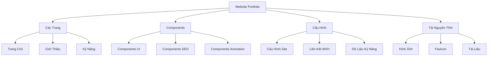

# Hướng Dẫn Xây Dựng Portfolio với Astro

## Mục Lục

- [1. Giới Thiệu về Astro](#1-giới-thiệu-về-astro)
- [2. Cấu Trúc Dự Án](#2-cấu-trúc-dự-án)
- [3. Các Khái Niệm Cơ Bản của Astro](#3-các-khái-niệm-cơ-bản-của-astro)
- [4. Hướng Dẫn Triển Khai Portfolio](#4-hướng-dẫn-triển-khai-portfolio)
- [5. Các Phương Pháp Tối Ưu](#5-các-phương-pháp-tối-ưu)

## 1. Giới Thiệu về Astro

### Astro là gì?

Astro là một framework hiện đại để xây dựng website với những ưu điểm:

- **Mặc định không có JavaScript**: Website không tải JavaScript về client nếu không cần thiết
- **Kiến trúc Islands**: Chỉ thêm tính tương tác ở những nơi cần thiết
- **Đa framework**: Hỗ trợ React, Vue, Svelte, hoặc HTML/CSS thuần
- **Trải nghiệm phát triển tốt**: Hỗ trợ TypeScript, Hot Module Reloading
- **Hiệu năng xuất sắc**: Được xây dựng với focus vào tốc độ và tối ưu hóa

### Tại sao chọn Astro cho Portfolio?

1. **Hiệu Năng Cao**

   - Tạo ra trang tĩnh
   - Tối thiểu hóa JavaScript
   - Tối ưu hóa tài nguyên

2. **Thân Thiện với SEO**

   - Xuất ra HTML tĩnh
   - Quản lý meta tags dễ dàng
   - Tự động tạo sitemap

3. **Trải Nghiệm Phát Triển Tốt**
   - Mô hình component đơn giản
   - Hỗ trợ TypeScript
   - Hỗ trợ Markdown

## 2. Cấu Trúc Dự Án

```
portfolio/
├── src/
│   ├── components/    # Các component có thể tái sử dụng
│   ├── layouts/       # Các layout trang
│   ├── pages/         # Các component định tuyến
│   ├── config/        # Cấu hình website
│   ├── styles/        # Style toàn cục
│   └── types/         # Định nghĩa TypeScript
├── public/           # Tài nguyên tĩnh
└── astro.config.mjs  # Cấu hình Astro
```

### Giải Thích Các Thư Mục Chính

#### `src/components/`

Các component UI được tổ chức theo chức năng:

```
components/
├── Navigation/     # Components liên quan đến điều hướng
├── SEO/           # Components tối ưu SEO
├── Social/        # Components mạng xã hội
├── Animation/     # Components animation
└── UI/           # Components UI chung
```

#### `src/config/`

Quản lý cấu hình:

```
config/
├── index.ts       # Cấu hình chính
├── social.ts      # Liên kết mạng xã hội
├── skills.ts      # Dữ liệu kỹ năng
└── seo.ts         # Cấu hình SEO
```

#### `src/pages/`

Cấu trúc định tuyến:

```
pages/
├── index.astro    # Trang chủ
├── about.astro    # Trang giới thiệu
├── skills.astro   # Trang kỹ năng
└── blog/          # Phần blog
```

## 3. Các Khái Niệm Cơ Bản của Astro

### 3.1 Cấu Trúc Component

```astro
---
// Script Component (Front Matter)
import { Image } from "astro:assets";
const { title } = Astro.props;
---

<!-- Template Component -->
<div class="component">
  <h1>{title}</h1>
  <slot />
  <!-- Nội dung con -->
</div>

<style>
  /* Style cho component */
  .component {
    @apply px-4 py-2;
  }
</style>
```

### 3.2 Quản Lý Dữ Liệu

```typescript
// src/config/index.ts
export const siteConfig = {
  title: "Portfolio",
  description: "Portfolio Cá Nhân",
  author: "Tên Của Bạn",
};
```

### 3.3 Định Tuyến

- Định tuyến dựa trên file
- Định tuyến động với `[param].astro`
- API routes với file `.ts`

## 4. Hướng Dẫn Triển Khai Portfolio

### 4.1 Thiết Lập Dự Án

```bash
# Tạo dự án mới
npm create astro@latest
# Thêm TypeScript
npx astro add typescript
# Thêm Tailwind CSS
npx astro add tailwind
```

### 4.2 Các Tính Năng Cần Thiết

#### Component SEO

```astro
---
// components/SEO.astro
const { title, description, image } = Astro.props;
---

<head>
  <title>{title}</title>
  <meta name="description" content={description} />
  <meta property="og:image" content={image} />
</head>
```

#### Component Hiển Thị Dự Án

```astro
---
// components/ProjectItem.astro
const { title, description, image, link } = Astro.props;
---

<article class="project-item">
  <Image src={image} alt={title} />
  <h3>{title}</h3>
  <p>{description}</p>
  <a href={link}>Xem Dự Án</a>
</article>
```

## 5. Các Phương Pháp Tối Ưu

### 5.1 Tối Ưu Hiệu Năng

1. **Tối Ưu Hình Ảnh**

   ```astro
   <Image src={image} alt={alt} width={800} height={600} format="webp" />
   ```

2. **Tối Ưu CSS**
   ```astro
   <style define:vars={{ color }}>
     .element {
       color: var(--color);
     }
   </style>
   ```

### 5.2 Các Phương Pháp SEO Tốt Nhất

1. **Meta Tags**

   ```astro
   <meta name="robots" content="index, follow" />
   <link rel="canonical" href={canonicalURL} />
   ```

2. **Dữ Liệu Có Cấu Trúc**
   ```astro
   <script type="application/ld+json">
     {
       "@context": "https://schema.org",
       "@type": "Person",
       "name": "Tên Của Bạn"
     }
   </script>
   ```

## Sơ Đồ Cấu Trúc Portfolio Hiện Tại



### Các Tính Năng Đã Triển Khai:

1. **Tối Ưu Hiệu Năng**

   - Tạo trang tĩnh
   - Tối ưu hình ảnh
   - Nén CSS
   - Lazy loading

2. **Tính Năng SEO**

   - Quản lý meta tags
   - Tạo sitemap
   - Robots.txt
   - Dữ liệu có cấu trúc

3. **Tính Năng UI/UX**

   - Thiết kế responsive
   - Giao diện tối
   - Animation mượt mà
   - Components tương tác

4. **Quản Lý Nội Dung**
   - Cấu hình TypeScript
   - Components module hóa
   - Tổ chức dữ liệu có cấu trúc

## Tài Nguyên Tham Khảo

1. [Tài Liệu Astro](https://docs.astro.build)
2. [Tài Liệu Tailwind CSS](https://tailwindcss.com/docs)
3. [Tài Liệu TypeScript](https://www.typescriptlang.org/docs)

## Lưu Ý Khi Phát Triển

1. **Tổ Chức Code**

   - Nhóm theo tính năng
   - Giữ components nhỏ gọn và tập trung
   - Sử dụng TypeScript interfaces

2. **Quản Lý Cấu Hình**

   - Tập trung hóa cấu hình
   - Sử dụng biến môi trường
   - Định nghĩa type cho tất cả cấu hình

3. **Tối Ưu Hóa**

   - Sử dụng lazy loading cho hình ảnh
   - Tối ưu bundle size
   - Implement caching phù hợp

4. **Bảo Trì**
   - Viết documentation rõ ràng
   - Tuân thủ các quy tắc đặt tên
   - Tổ chức git commits hợp lý
